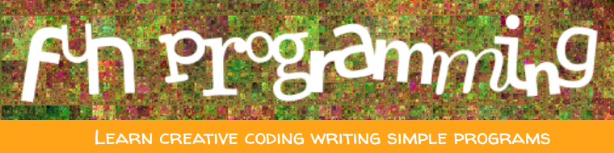

 
# Programming is Fun

In this project you will follow THREE tutorials using the website [Fun Programming](https://funprogramming.org/). You must copy the contents of each file in 
FunProcessing1.pde
FunProcessing2.pde
FunProcessing3.pde

Be sure to name your file name as indicated. 

Samples of Student Work
-----------------------

